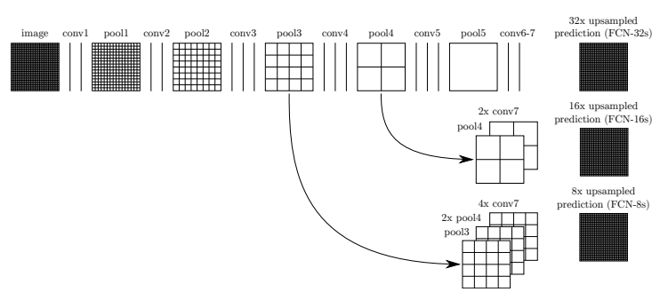
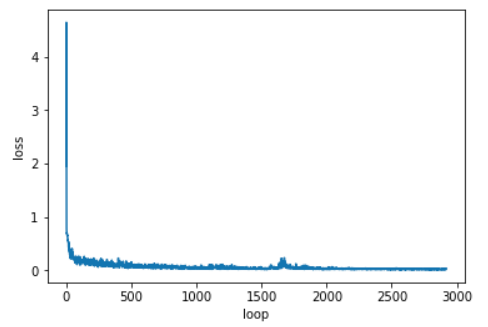

# Semantic Segmentation

### Intro
Labeling the pixels of a road in images using a Fully Convolutional Network (FCN).

### Models

Reference to [Fully Convolutional Networks for Semantic Segmentation](https://people.eecs.berkeley.edu/~jonlong/long_shelhamer_fcn.pdf) basically I mimic what's model mentioned in this paper.



Remove some kernel regularizer param for readability please check `main.py` for more details.

```python
# Get all layers out of vgg
# layer 7
vgg_layer7_conv_1x1 = tf.layers.conv2d(vgg_layer7_out, num_classes, 1, padding='same')
# layer 4
vgg_layer4_conv_1x1 = tf.layers.conv2d(vgg_layer4_out, num_classes, 1, padding='same')
# layer 3
vgg_layer3_conv_1x1 = tf.layers.conv2d(vgg_layer3_out, num_classes, 1, padding='same')

    
# 2xConv7
output = tf.layers.conv2d_transpose(vgg_layer7_conv_1x1, num_classes, 4, 2, padding='same')
# pool4 + 2xConv7
output = tf.add(output, vgg_layer4_conv_1x1)
# 2x(pool4 + 2xCon7) => 2xpool4 + 4xConv7    
output = tf.layers.conv2d_transpose(output, num_classes, 4, 2, padding='same')

# pool3 + 2xpool4 + 4xConv7
output = tf.add(output, vgg_layer3_conv_1x1)
output = tf.layers.conv2d_transpose(output, num_classes, 16, 8, padding='same')

return output 
```

### Run
Run the following command to run the project:
```
python main.py
```
 
 ### Run with GPU 
I find it very fast trained it on AWS GPU compute, I use `p3.2xlarge` instance and be mindful of the cost! 
 
I use provided Amazon Deep Learning AMI `Deep Learning AMI (Ubuntu) Version 10.0` to train the model and get the output. 

In the infra folder, there is terraform code to spin up `EC2` and `Security Group` for `ssh 22` and `jupyter notebook 8888`

```hcl-terraform
// init
terraform init && terraform get

// plan
// config my region, instance type and aws profile
terraform plan -var-file=config.tfvars -var keyname=YOUR_KEY

// apply this is where $$$ magic happens
terraform apply -var-file=config.tfvars -var keyname=YOUR_KEY
```

there should be the result as below so copy the IP address of the machine to ssh to.

```bash
Apply complete! Resources: 2 added, 0 changed, 0 destroyed.

Outputs:

deeplearning_ami = ami-6d720012
deeplearning_instance = 34.239.169.249
deeplearning_sg = terraform-20180626015919629500000001
```

normally it will take around 2-3 minutes, for instance, to spin up

```bash
// OUTPUT_IP_ADDRESS above 34.239.169.249 is IP from above result please replace with
ssh -i YOUR_KEY.pem ubuntu@OUTPUT_IP_ADDRESS
```

Lastly, I switch profile to `activate tensorflow_p36` and download the VGG16 model from the link below in Tips section or check out `infra/setup.sh`

Then install these addition pip packages for this project and you're good to go.
```bash
pip install tqdm
pip install moviepy
```

### Training

As mentioned above, I use AWS GPU to train the model with these parameters

* Epoch 40
* Batch Size 4
* Learning rate 0.0005
* Keep Probability 0.5

### Result

The training result running in AWS took me `13 minutes` to complete `40` epochs which took me forever on CPU!

`100%|███████████████████████████████████████████████████████████████████████████████| 40/40 [13:16<00:00, 19.91s/it]`

Minimize Loss in training 

  

And here are example outputs labeling the pixels of a road


 
 there are not perfect but somewhere more than 80% correctly painted.
 
 ##### Frameworks and Packages
 Make sure you have the following is installed:
  - [Python 3](https://www.python.org/)
  - [TensorFlow](https://www.tensorflow.org/)
  - [NumPy](http://www.numpy.org/)
  - [SciPy](https://www.scipy.org/)
 ##### Dataset
 Download the [Kitti Road dataset](http://www.cvlibs.net/datasets/kitti/eval_road.php) from [here](http://www.cvlibs.net/download.php?file=data_road.zip).  Extract the dataset in the `data` folder.  This will create the folder `data_road` with all the training a test images.

 
 ### Tips
- The link for the frozen `VGG16` model is hardcoded into `helper.py`.  The model can be found [here](https://s3-us-west-1.amazonaws.com/udacity-selfdrivingcar/vgg.zip)
- The model is not vanilla `VGG16`, but a fully convolutional version, which already contains the 1x1 convolutions to replace the fully connected layers. Please see this [forum post](https://discussions.udacity.com/t/here-is-some-advice-and-clarifications-about-the-semantic-segmentation-project/403100/8?u=subodh.malgonde) for more information.  A summary of additional points, follow. 
- The original FCN-8s was trained in stages. The authors later uploaded a version that was trained all at once to their GitHub repo.  The version in the GitHub repo has one important difference: The outputs of pooling layers 3 and 4 are scaled before they are fed into the 1x1 convolutions.  As a result, some students have found that the model learns much better with the scaling layers included. The model may not converge substantially faster but may reach a higher IoU and accuracy. 
- When adding l2-regularization, setting a regularizer in the arguments of the `tf.layers` is not enough. Regularization loss terms must be manually added to your loss function. otherwise, regularization is not implemented.
- Also specify kernel initializer `kernel_initializer= tf.random_normal_initializer(stddev=0.001)` to each `tf.layers` as well as l2-regularization